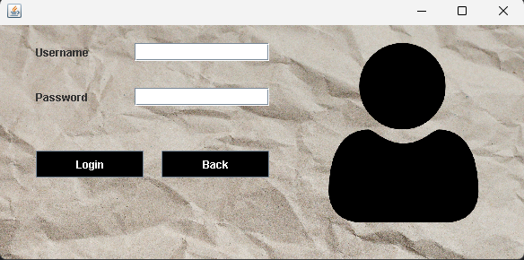
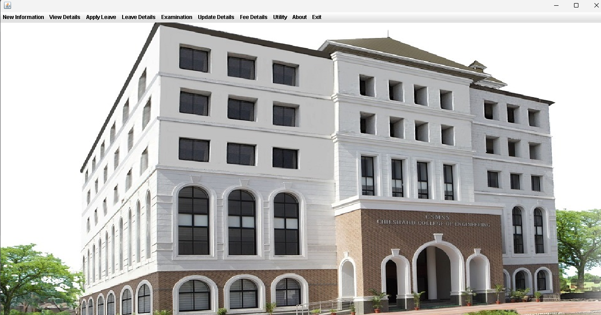
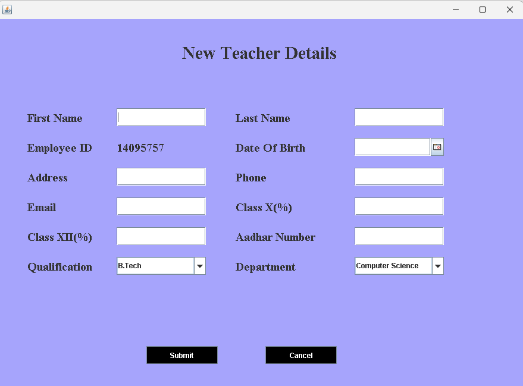
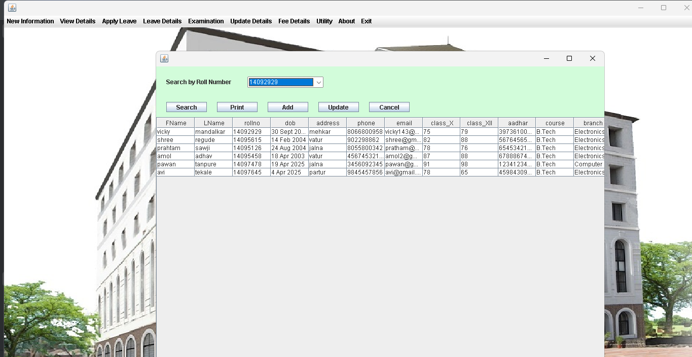
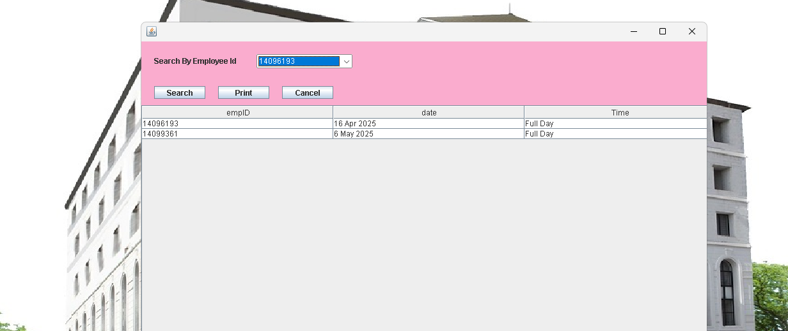
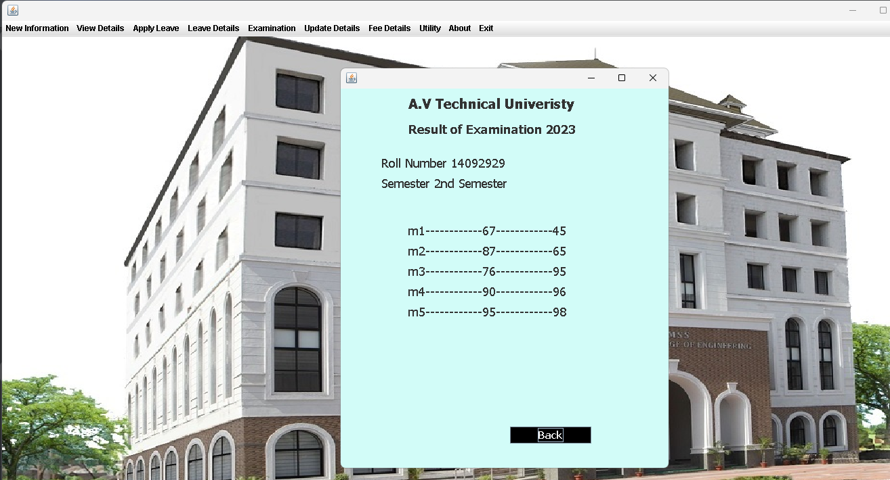

# 🎓 College Management System

A desktop-based **College Management System** built in **Java (Swing)** that provides a comprehensive solution for managing students, teachers, examinations, fees, and leave records for an engineering college.

---

## 📸 Screenshots

| Login Screen | Main Dashboard |
|---|---|
|  |  |

| New Teacher Registration | Student Records |
|---|---|
|  |  |

| Apply Leave | Examination Results |
|---|---|
|  |  |

---

## 📋 Table of Contents

- [About](#about)
- [Features](#features)
- [Tech Stack](#tech-stack)
- [Project Structure](#project-structure)
- [Database Setup](#database-setup)
- [How to Run](#how-to-run)
- [Screenshots Overview](#screenshots-overview)
- [Author](#author)

---

## About

The College Management System is a Java-based desktop application developed for **CSMSS CSCOE, Chh. Sambhaji Nagar**, affiliated with **Dr. Babasaheb Ambedkar Technological University (BATU), Lonere**. It streamlines day-to-day administrative tasks, enabling staff and administrators to manage institutional data efficiently from a single unified interface.

---

## ✨ Features

### 👤 Authentication
- Secure login with username and password
- Role-based access control

### 📝 New Information
- Register new **Students** with full details (name, roll number, DOB, address, phone, email, academic scores, Aadhar, course, branch)
- Register new **Teachers** with full details (name, employee ID, DOB, address, phone, email, academic scores, Aadhar, qualification, department)

### 🔍 View Details
- View and search **student records** by roll number
- View and search **teacher records** by employee ID
- Print records directly from the application

### 🏖️ Apply Leave
- Teachers can apply for leave by selecting their Employee ID and date
- Supports full-day leave applications

### 📋 Leave Details
- View leave history filtered by Employee ID
- Displays employee ID, date, and leave type (Full Day)
- Print leave records

### 📊 Examination
- Check student results by roll number
- Displays semester-wise marks for all subjects (m1–m5)
- Shows internal and external marks

### ✏️ Update Details
- Update existing **student** information
- Update existing **teacher** information by selecting Employee ID

### 💰 Fee Details
- View complete **Fee Structure** for all courses (B.Tech, B.Sc, BCA, M.Tech, M.Sc, MBA, MCA, B.Com, M.Com) across all semesters

### 🛠️ Utility
- Additional utility features

### ℹ️ About
- Displays college information (CSMSS CSCOE, Chh. Sambhaji Nagar)
- University affiliation (BATU Lonere)
- Contact: srkarpe@csmssengg.org

---

## 🛠️ Tech Stack

| Technology | Usage |
|---|---|
| **Java** | Core programming language |
| **Java Swing** | GUI / Desktop UI framework |
| **JDBC** | Database connectivity |
| **MySQL** | Backend relational database |
| **NetBeans / Eclipse** | Recommended IDE |

---

## 🗂️ Project Structure

```
College-Management-System/
│
├── src/
│   ├── college/
│   │   ├── Login.java              # Login screen
│   │   ├── Main.java               # Main dashboard with menu bar
│   │   ├── NewStudent.java         # Add new student
│   │   ├── NewTeacher.java         # Add new teacher
│   │   ├── ViewStudent.java        # View/search student records
│   │   ├── ViewTeacher.java        # View/search teacher records
│   │   ├── ApplyLeave.java         # Teacher leave application
│   │   ├── LeaveDetails.java       # View leave history
│   │   ├── Examination.java        # Check exam results
│   │   ├── UpdateStudent.java      # Update student details
│   │   ├── UpdateTeacher.java      # Update teacher details
│   │   ├── FeeStructure.java       # View fee structure
│   │   └── About.java              # About screen
│   └── icons/                      # Image assets
│
└── README.md
```

---

## 🗄️ Database Setup

1. Install **MySQL** and create a database:

```sql
CREATE DATABASE college_management;
USE college_management;
```

2. Create the required tables:

```sql
-- Students table
CREATE TABLE student (
    fname VARCHAR(50),
    lname VARCHAR(50),
    rollno BIGINT PRIMARY KEY,
    dob DATE,
    address VARCHAR(100),
    phone BIGINT,
    email VARCHAR(100),
    class_X INT,
    class_XII INT,
    aadhar BIGINT,
    course VARCHAR(20),
    branch VARCHAR(50)
);

-- Teachers table
CREATE TABLE teacher (
    fname VARCHAR(50),
    lname VARCHAR(50),
    empID BIGINT PRIMARY KEY,
    dob DATE,
    address VARCHAR(100),
    phone BIGINT,
    email VARCHAR(100),
    class_X INT,
    class_XII INT,
    aadhar BIGINT,
    qualification VARCHAR(20),
    department VARCHAR(50)
);

-- Leave table
CREATE TABLE leave_details (
    empID BIGINT,
    date DATE,
    time VARCHAR(20)
);

-- Examination results table
CREATE TABLE result (
    rollno BIGINT,
    semester VARCHAR(20),
    m1 INT, m2 INT, m3 INT, m4 INT, m5 INT,
    em1 INT, em2 INT, em3 INT, em4 INT, em5 INT
);

-- Fee structure table
CREATE TABLE fee (
    course VARCHAR(20),
    semester1 INT, semester2 INT, semester3 INT, semester4 INT,
    semester5 INT, semester6 INT, semester7 INT, semester8 INT
);

-- Login table
CREATE TABLE login (
    username VARCHAR(50),
    password VARCHAR(50)
);
```

3. Update the **JDBC connection** in your source files:

```java
Connection con = DriverManager.getConnection(
    "jdbc:mysql://localhost:3306/college_management",
    "your_username",
    "your_password"
);
```

---

## ▶️ How to Run

### Prerequisites
- Java JDK 8 or above
- MySQL Server
- NetBeans IDE (recommended) or any Java IDE

### Steps

1. **Clone the repository**
```bash
git clone https://github.com/vicky-mandalkar/College-Management-System.git
cd College-Management-System
```

2. **Set up the database** — follow the [Database Setup](#database-setup) steps above.

3. **Open the project** in NetBeans or Eclipse.

4. **Add the MySQL JDBC driver** (`mysql-connector-java.jar`) to your project's build path.

5. **Update database credentials** in the connection string across the source files.

6. **Build and Run** the project — the Login screen will appear.

### Default Login
> Set up a username and password in the `login` table of your database before running.

---

## 📷 Screenshots Overview

| Screen | Description |
|---|---|
| **Login** | Secure login with username/password and user icon |
| **Dashboard** | Main window with college building image and full menu bar |
| **New Teacher Details** | Form to register a new teacher with all personal and academic info |
| **Student Records** | Searchable table of all students with roll number filter |
| **Apply Leave** | Date-picker based leave application form for teachers |
| **Leave Details** | Pink-themed table showing leave history per employee |
| **Check Result** | Student list with a Result button to view exam scores |
| **Exam Result** | Detailed per-semester marks card (internal + external) |
| **Update Teacher** | Pre-filled form to edit teacher details by Employee ID |
| **Fee Structure** | Full course-wise semester fee table |
| **About** | College name, university affiliation, and contact info |

---

## 👨‍💻 Author

**Vicky Mandalkar**  
CSMSS CSCOE, Chh. Sambhaji Nagar  
Affiliated with Dr. Babasaheb Ambedkar Technological University (DBATU), Lonere


